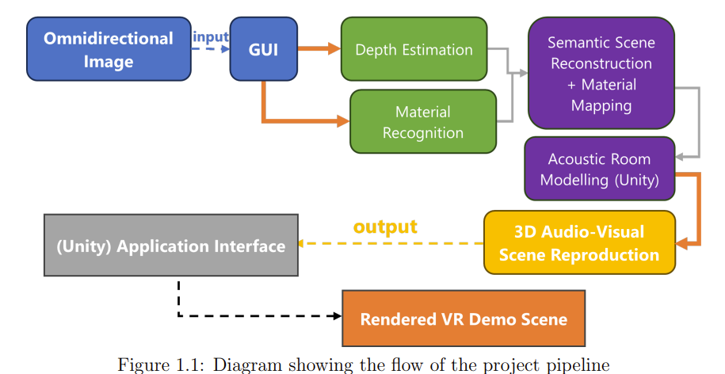

# Immersive Audio-Visual VR Scene Reproduction

This project aims to reconstruct 3D geometry and acoustic properties of environments from a single 360° image for plausible audio-visual VR reproduction. It builds on the seminal work of Dr. Hansung Kim and extends research done by University of Southampton 4th year CS and EE students.

## Project Structure

The repository is structured as follows:

- `360monodepth/`: Submodule for monocular 360° depth estimation (Docker-based)
- `Atiyeh-RIR-evaluation-Matlab`: Matlab related scripts for audio analysis
- `AVVR-Papers/`: Related research papers
- `edgenet360/`: Submodule for mesh generation (WSL-based)
  - `Output/`: Directory for generated meshes in .obj format
- `Intern-logs/`: Weekly logs from internship work including AudioResult excel
  - `Internship-Report.pdf`: 10-week internship technical report
- `material_recognition/`: Submodule for material recognition using Dynamic Backward Attention Transformer
- `RIR_Analysis`: Python notebook for sine sweep and deconvolution by Mona
- `scripts/`: Automation and integration scripts
  - `GUI.py`: Main script to be run after following the setup instructions
- `Unity/`: 
  - `AV-VR/`: Main Unity project folder, extending GDP work
  - `S3A/`: Dr. Hansung's original Unity project for reference (Steam Audio integration, sound source positioning)

## Key Files

- `.gitattributes`: Specifies attributes for repository files
- `.gitignore`: Lists files and directories to be ignored by Git
- `.gitmodules`: Defines submodule configurations
- `GanttChart`: Work plan and daily log summary
- `LICENSE`: Project license information
- `Manual.docx` / `Manual.pdf`: User manual provided by the GDP group
- `Intern-logs/Internship-Report.pdf`: 10-week internship technical report

## Pipeline Overview

## Video Demonstration

[KT and ST scene demo](https://youtu.be/CDhq749k1hQ)

## Getting Started

Please follow the instructions in the Manual.pdf regarding prerequisites for the ML pipeline and VR rendering using Unity. Detailed setup steps and requirements are provided to ensure smooth operation of the project components.

Note there are hardcoded directory in certain scripts that need to be changed to reflect your work directory, in the future, this would only be one file, but to be safe, please use find and replace all directory instances in your favourite code editor.

## Contributing

To contribute to this project:

1. Fork the necessary submodules if you are making changes to them.
2. Create an issue describing the changes you propose.
3. Submit a pull request referencing the issue.

Please ensure your code adheres to the project's coding standards and includes appropriate documentation.

## Acknowledgements

This work is based on Dr. Hansung Kim's research at the University of Southampton and extends the Group Design Project by 4th year EE students. 

For more information on the foundational work, please visit:
- [3D Kim VR Research (EUSIPCO)](http://3dkim.com/research/VR/EUSIPCO.html)
- [3D Kim VR Research Main Page](http://3dkim.com/research/VR/index.html)

[Github repo link for previous work TBD]

## Future Work

- Enhance monodepth depth image to fit better with EdgeNet360
- Remove unnecessary files to reduce git repository size
- Export the whole pipeline into a single executable file without need for prerequisite and setups (ambitious goal)

## License

Currently, this project is under the MIT License. However, considering that it builds upon existing research work, we are reviewing the most appropriate license that respects the original contributions while allowing for further research and development.

Note: The license may be subject to change in the future to better align with research and collaborative requirements.